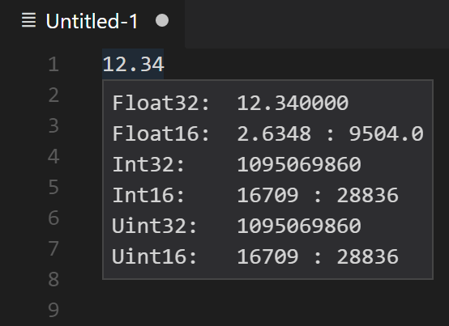
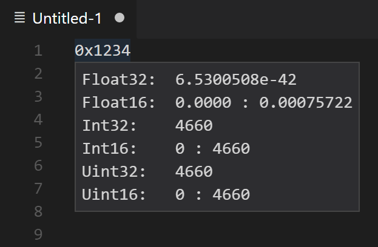
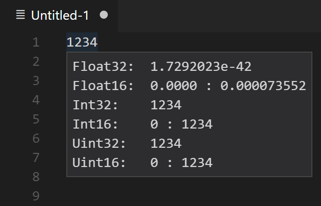

# Literal Preview

This extension provides a way to preview literals in different numerical representations when hovering over them.

Open the command palette (`Ctrl+Shift+P`) and type `Enable: Preview Literals` to enable hovering over literals. Type `Disable: Preview Literals` to disable the feature.

## Features

Previewing a
- 32bit **floating point** literal
- 32bit **hexadecimal** literal
- 32bit **decimal** literal

as 
- 32bit **floating point** value
- 2x 16bit **floating point** value
- 32bit **signed integer** value
- 2x 16bit **signed integer** value
- 32bit **unsigned integer** value
- 2x 16bit **unsigned integer** value

The higher 16bit values are always shown first.

## Pictures

Floating point preview:

Hexadecimal preview:

Integer preview

## Known Issues

- There is no explicit support for NaN and Infinity for floating point literals. 
- Negated literals are not recognized

## Release Notes

### 1.0.0
Initial release.

## License

This extension is under the MIT license. See [License](https://github.com/GPUOpen-Tools/vscode-extensions/blob/master/LICENSE) file for full license information.